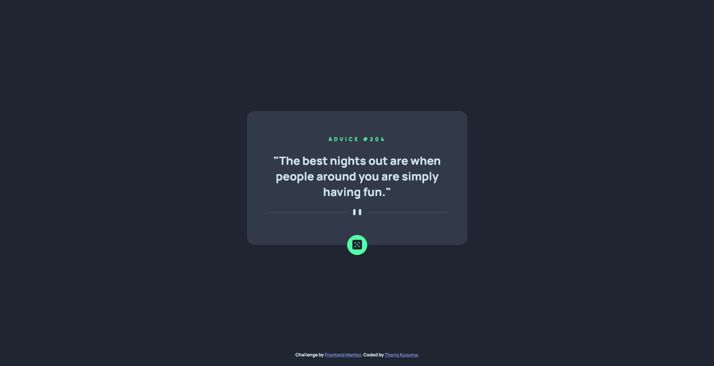

# Frontend Mentor - Advice generator app solution

This is a solution to the [Advice generator app challenge on Frontend Mentor](https://www.frontendmentor.io/challenges/advice-generator-app-QdUG-13db). Frontend Mentor challenges help you improve your coding skills by building realistic projects.

## Table of contents

- [Frontend Mentor - Advice generator app solution](#frontend-mentor---advice-generator-app-solution)
  - [Table of contents](#table-of-contents)
  - [Overview](#overview)
    - [The challenge](#the-challenge)
    - [Screenshot](#screenshot)
    - [Links](#links)
  - [My process](#my-process)
    - [Built with](#built-with)
    - [What I learned](#what-i-learned)
  - [Author](#author)

## Overview

### The challenge

Users should be able to:

- View the optimal layout for the app depending on their device's screen size
- See hover states for all interactive elements on the page
- Generate a new piece of advice by clicking the dice icon

### Screenshot



### Links

- Solution URL: [GitHub Repo](https://your-solution-url.com)
- Live Site URL: [GitHub Page](https://your-live-site-url.com)

## My process

### Built with

- Semantic HTML5 markup
- CSS custom properties
- ES6 Javascript
- Flexbox
- Mobile-first workflow

### What I learned

In this project I learned about fetching and using data from API. I'm using [Advice Slip API](https://api.adviceslip.com). I'm also learning about ES6, with using Promise, and async/await.

```html
<article>
        <h1 class="advice-id">Advice #1</h1>
        <p class="advice">
          "Age is of no importance, unless you are a cheese."
        </p>
        <figure>
          <div class="breakline-svg"></div>
        </figure>
      </article>
      <button class="btn-getadvice" type="submit"> svg-icon </button>
```
```css
button {
  width: 50px;
  height: 50px;
  border-radius: 50%;
  margin-left: auto;
  margin-right: auto;
  margin-top: -25px;
  background-color: var(--neon-green);
  border: none;
  cursor: pointer;
  transition: 500ms;
}

button:hover {
  box-shadow: 0 0 10px var(--neon-green);
  rotate: 45deg;
  transform: scale(1.1);
}
```
```js
const getAdvice = document.querySelector(".btn-getadvice");
const advice = document.querySelector(".advice");
const adviceId = document.querySelector(".advice-id");

document.addEventListener("DOMContentLoaded", async function () {
  try {
    const data = await fetchAdvice();
    console.log(data.slip);
    adviceRender(data);
  } catch (error) {
    alert(error);
  }
})

getAdvice.addEventListener('click', async function () {
  try {
    const data = await fetchAdvice();
    console.log(data.slip);
    adviceRender(data);
  } catch (error) {
    alert(error);
  }
});

async function fetchAdvice() {
  const response = await fetch("https://api.adviceslip.com/advice", { cache: "no-store" });
  if (!response.ok) throw new Error('Error to fetch API!!!');
  return response.json();
}

function adviceRender(data) {
  adviceId.textContent = `advice #${data.slip.id}`;
  advice.textContent = `"${data.slip.advice}"`;
}
```

## Author

- Website - [Links](https://www.prmdtya-links.vercel.app)
- Frontend Mentor - [@prmditya](https://www.frontendmentor.io/profile/prmditya)
- GitHub - [prmditya](https://www.github.com/prmditya)
